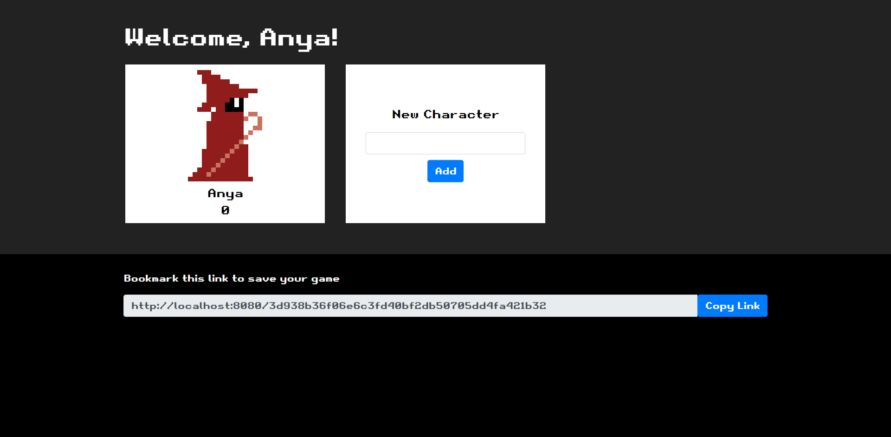

# Quiz Journey

## Introduction

Quizzing turned into fun, this application is to make education topics fun for learning through a game for students.

This app runs on `express`, `express-handlebars`, `mysql2`, and `sequelize` Node.js modules, along with many others.

[Live Demo](https://evening-refuge-98999.herokuapp.com/)


## Installation

**Note.js v13+** and **MySQL v8+** are required in order to run this script.

1. Download or clone this repository into your local computer.
2. Log into your MySQL server and run the SQL files `./database/schema.sql`, `./database/locations.sql` and `./database/seeds.sql` to initialize the database.
3. In your terminal, browse to the folder and run `npm install --production`.
4. Create a `.env` file into the root folder with your own credentials so the app can connect to your MySQL server. Use this template to help get your app going:
```
DB_USER=root
DB_PASSWORD=
DB_NAME=quiz_journey
DB_HOST=localhost
```


## Usage

1. In your terminal, run the script with the command `npm start` or `node server.js`. This will run a local server that hosts the web app on port 8080.
2. Visit `http://localhost:8080` to access the web app.
3. Start a new game, registering with your name.
4. Add a character.
5. Click on character to begin your journey!


## Preview


